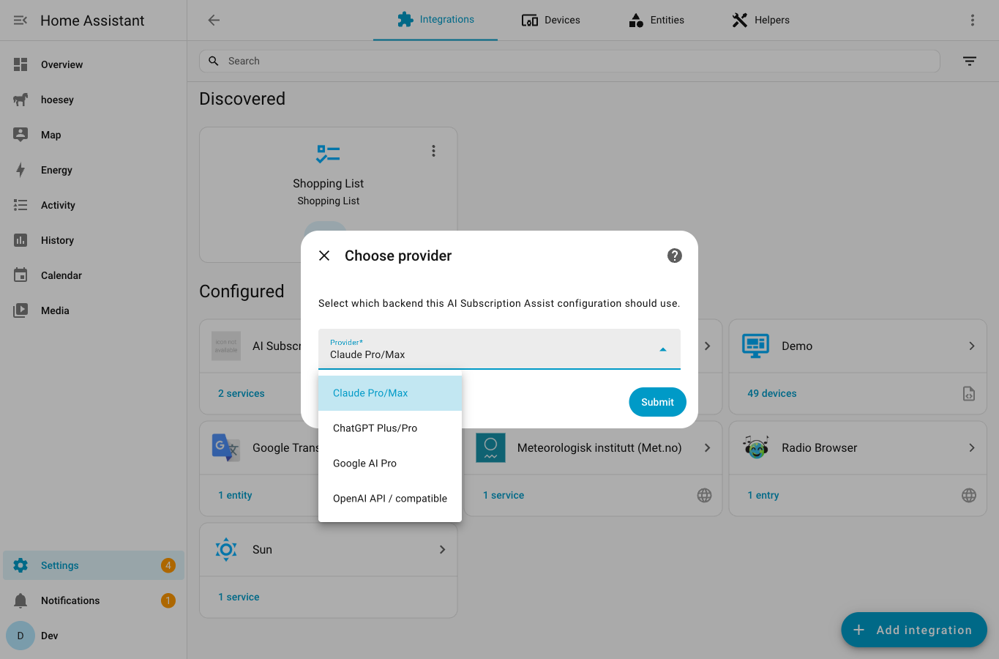
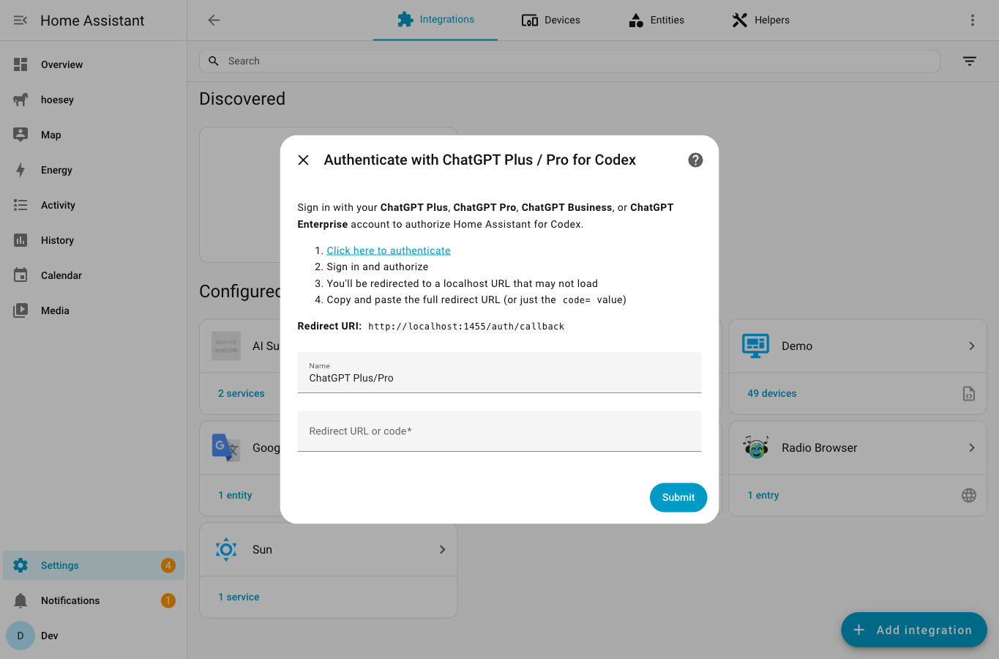
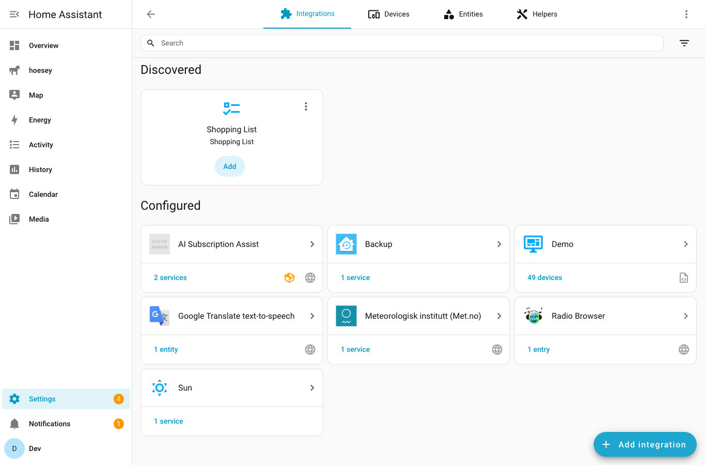
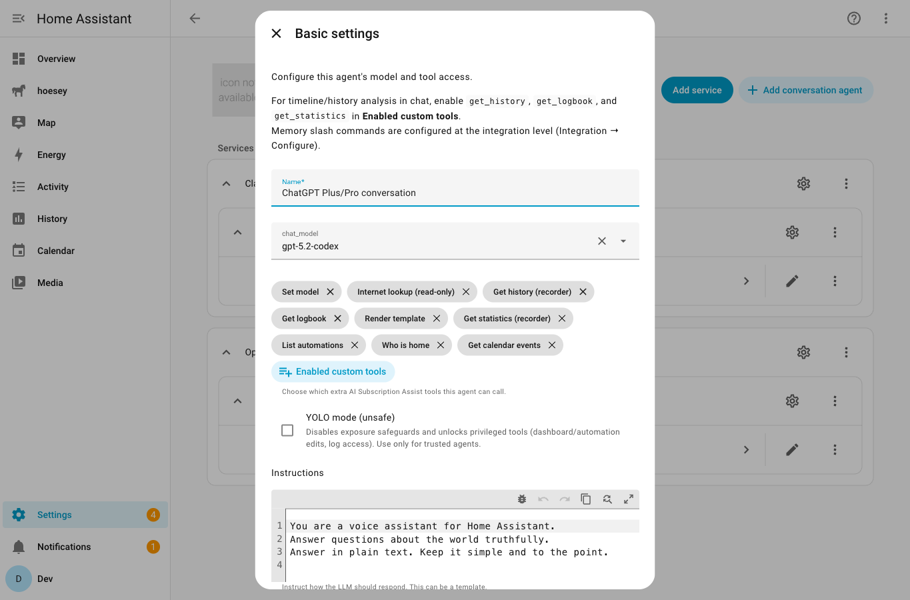
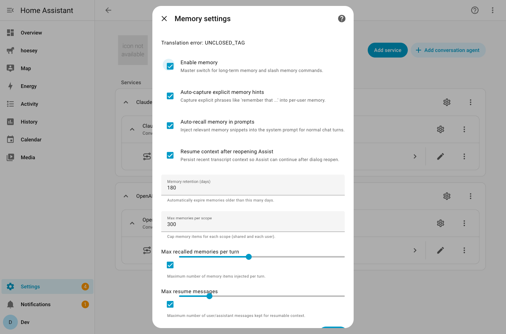
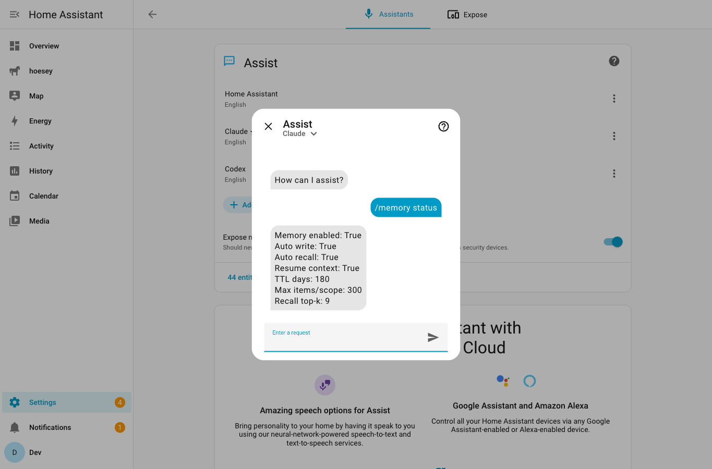
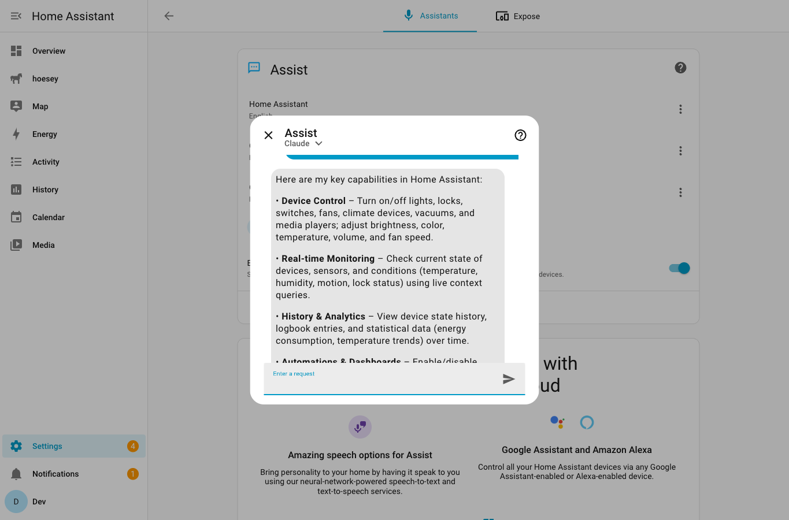

# Getting Started

This guide is for getting **AI Subscription Assist** running quickly, then validating core capabilities.

Use this as both:
- a first-run setup guide for users
- a screenshot capture checklist for documentation

---

## 0) Prerequisites

- Home Assistant `2026.2.2+`
- HACS installed (recommended path)
- At least one provider account:
  - Claude Pro/Max
  - ChatGPT Plus/Pro/Business/Enterprise (Codex)
  - Google AI Pro
  - OpenAI-compatible API key

---

## 1) Install Integration From HACS

1. Go to `HACS -> Integrations`.
2. Open `... -> Custom repositories`.
3. Add `toml0006/ai-subscription-assist` as type `Integration`.
4. Install **AI Subscription Assist**.
5. Restart Home Assistant.

---

## 2) Add The Integration

1. Go to `Settings -> Devices & services`.
2. Click `Add integration`.
3. Search for `AI Subscription Assist`.
4. Select your provider.

### Screenshot

Capture:
- Search results showing AI Subscription Assist
- Provider choices visible (Claude, ChatGPT/Codex, Google AI Pro, OpenAI-compatible)

---

## 3) Authenticate Provider

Follow the provider-specific flow shown in the integration.

Notes:
- OAuth flows may redirect to `http://localhost/...` URLs that do not load.
- Copy/paste the full callback URL (or `code=` value when instructed).

### Screenshot

Capture:
- The in-app OAuth instructions with redirect URI

### Screenshot

Capture:
- Provider config entry created under Devices & services

---

## 4) Add Or Reconfigure A Conversation Agent

1. Open your provider entry.
2. Add a `conversation agent` sub-entry (or reconfigure existing).
3. Set:
  - `Model`
  - `Enabled custom tools`
  - `YOLO mode` (only if intentionally needed)
4. In `Control Home Assistant`, select:
  - `AI Subscription Assist - <entry> - <agent>`

### Screenshot

Capture:
- Model selector
- Enabled custom tools selector
- YOLO mode toggle
- Correct AI Subscription Assist API selected

---

## 5) Enable Service-Level Memory

1. Open the provider integration entry.
2. Click `Configure` (service-level options).
3. Enable memory settings:
  - `Enable memory`
  - `Auto-capture explicit memory hints`
  - `Auto-recall memory in prompts`
  - `Resume context after reopening Assist`
4. Save.

### Screenshot

Capture:
- Memory toggles and limits shown in options form

---

## 6) Verify Core Capabilities In Assist

Open Assist and run these quick checks.

### 6.1 Basic control
Prompt example:
- `Turn on the living room light`

### 6.2 Memory commands
Prompt examples:
- `/memory status`
- `/remember I prefer concise responses`
- `/memory list mine`
- `/memory sessions`
- `/new`

### 6.3 History and timeline analysis
Prereq: enable tools `get_history`, `get_logbook`, `get_statistics`.

Prompt examples:
- `When did the office light last turn on?`
- `Show me notable events for the last 6 hours`

### 6.4 Internet read-only lookup
Prereq: enable tool `internet_lookup`.

Prompt examples:
- `Look up the latest Home Assistant release notes and summarize`
- `Fetch https://www.home-assistant.io/blog/ and list recent posts`

### Screenshot

Capture:
- `/memory` command and response in Assist chat

### Screenshot

Capture:
- A response using history/logbook/statistics context
- A response using internet lookup with source URLs

### 6.5 Manage memory/session in integration panel
Open sidebar item `AI Assist Memory` (path: `/ai-subscription-assist-memory`) and validate:
- Entry selector works across provider entries
- Memory filters (`scope`, search) and delete/clear actions
- Session filters (`scope`, `subentry_id`) and session detail viewer

Screenshot to capture:
- Panel showing memory table + session table + session detail

### 6.6 Manage memory/session in addon services
Open `Developer Tools -> Actions` and use:
- `claude_assist.memory_status`
- `claude_assist.memory_list`
- `claude_assist.memory_delete`
- `claude_assist.memory_clear`
- `claude_assist.session_list`
- `claude_assist.session_get`
- `claude_assist.session_clear`

---

## 7) Screenshot File Checklist

Store screenshots in:
- `docs/screenshots/getting-started/`

Expected filenames:
- `01-add-integration-provider-selection.png`
- `02-oauth-instructions.png`
- `03-provider-entry-created.png`
- `04-agent-setup.png`
- `05-memory-settings.png`
- `06-assist-memory-command.png`
- `07-assist-capabilities.png`
- `08-memory-panel.png`

Capture quality guidelines:
- Use desktop aspect ratio when possible.
- Keep text readable (avoid very high browser zoom-out).
- Blur/redact API keys, emails, account IDs, and exact home address.
- Prefer dark/light theme consistency across all shots.
